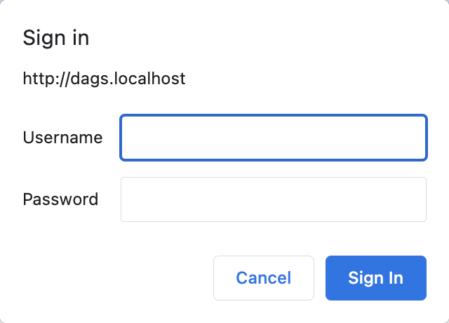
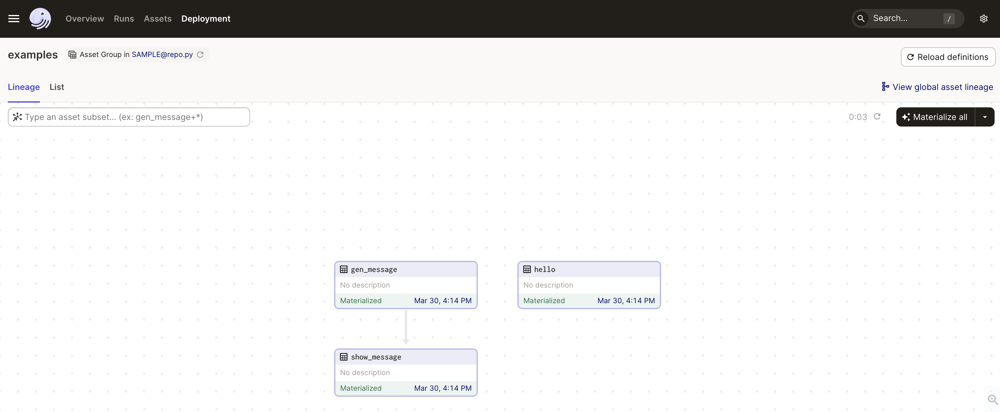

# **Run Dagster Dags in Docker (with Basic Authentication)**

A rudimentary template for a quick Dagster project setup in Docker. This is based on the image build process illustrated in the [Deploying Dagster to Docker](https://docs.dagster.io/deployment/guides/docker) section.

## **Setup**
```
git clone https://github.com/sarit-si/dagster-docker-template.git
cd dagster-docker-template
docker compose up -d
````

- (Optional) Create `home` folder incase customization of dagster instance is required (discussed below).
- (Optional) To customise the Dagster instance, a [`dagster.yaml`](https://docs.dagster.io/deployment/dagster-instance) needs to be created. Place it in the `home` folder. This needs `docker compose down && docker compose up -d`. Without the `dagster.yaml`, dagster will write logs, events, storage, etc. to `/opt/dags/home` folder inside the conatiner.
- `home` and `dags` folders are volume mounted inside the container.
- All assets, resources, etc. need to be placed inside the `dags` folder.


## **Basic authentication**

- As of writing this, Dagster (not Dagster Cloud) does not come with basic authentication out of the box.
- Used a reverse proxy [Traefik](https://doc.traefik.io/traefik/middlewares/http/basicauth/) to add an "at-least some" secure layer to authenticate users.
- Traefik has been added as a service in the docker compose file.
- For the sake of experimentaion, the credentials ***admin/admin*** are set directtly in the compose file instead of as env variables. To have your own, follow the steps illustrated in the [Traefik official docs](https://doc.traefik.io/traefik/middlewares/http/basicauth/).


